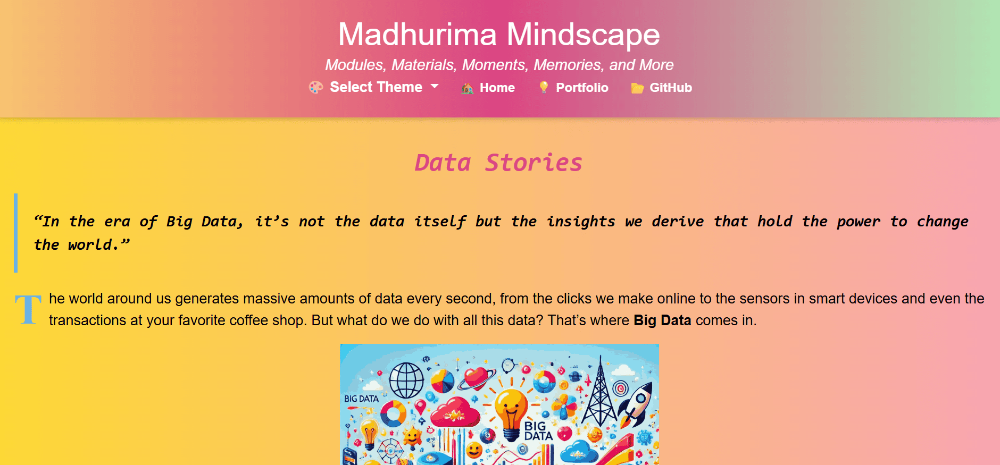
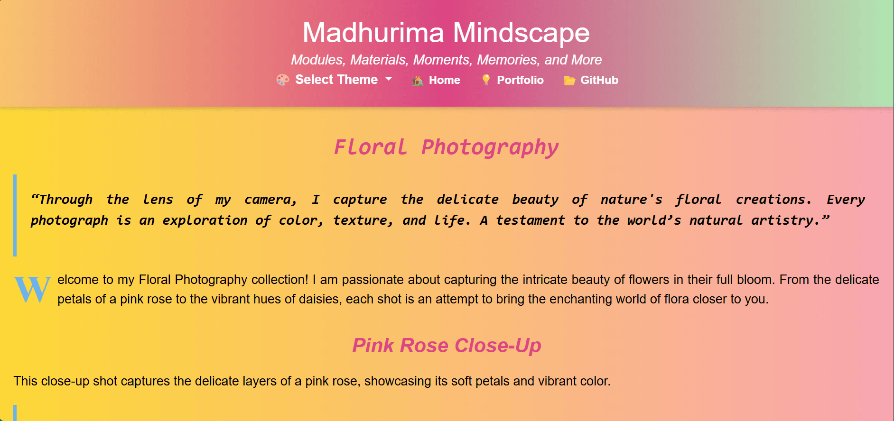

# Madhurima-Mindscape
This is a personal blog where I share a variety of content, including personal reflections, tech insights, project diaries, and creative photography. Explore different categories such as personal growth, tech insights, and project experiences.

---

## Sections of the Blog

<h3>1. Introduction</h3>
Overview of the blog and an introduction to my journey and thoughts.

<h3>2. Personal Insights</h3>
Reflections on personal experiences and lessons learned along the way.

<h3>3. Tech Insights</h3>
Articles on various tools, platforms, and technologies, including my experiences and advice.

<h3>4. Project Diaries</h3>
Behind-the-scenes looks at the development of my various projects.

<h3>5. Creative Clicks</h3>
A collection of my photography work and creative expressions through the lens.

---

## Website Snapshots

  

  

  

  

  

  

  

---

## Features

- **Responsive Design:** The website is fully responsive and works seamlessly on all devices.
- **Dynamic Content:** The website includes sections that cater to both personal and professional content.
- **Creative Exploration:** A place to showcase not just technical projects but also personal insights and creative work like photography.
  
---

## Resources

Logos and images were generated using ChatGPT: <a href = "https://chatgpt.com/">ChatGPT</a>

---

## Thanks for Visiting 😄

- Drop a 🌟 if you find this repository useful.  
- If you have any doubts or suggestions, feel free to reach me.  
📫 How to reach me:  &nbsp;  &nbsp; &nbsp;
  
- **Contribute and Discuss:** Feel free to open <a href= "https://github.com/madhurimarawat/Madhurima-Mindscape/issues">issues 🐛</a>, submit <a href = "https://github.com/madhurimarawat/Madhurima-Mindscape/pulls">pull requests 🛠️</a>, or start <a href = "https://github.com/madhurimarawat/Madhurima-Mindscape/discussions">discussions 💬</a> to help improve this repository!
